# 👋 Hey there, I'm Muhammad Ahmed!

AI Engineer | Generative AI | NLP | LLMs & AI Agents

   <h3><code>m11ahmed@github ~ $ whoami</code></h3>
   
   

<h3><code>m11ahmed@github ~ $ ./contributions.sh</code></h3>

Software Engineering graduate passionate about building intelligent systems and AI-powered applications. I enjoy turning ideas into practical solutions and experimenting with modern AI development workflows.

- 🤖 Building with LLMs, NLP, Generative AI & AI Agents
- ⚡ Working with Ollama, Claude Code & AI-assisted development
- 🧠 Exploring MCP, RAG, LangChain & local LLMs
- 🚀 Building AI-powered web applications and software projects
- 🎯 Looking for opportunities to grow as an AI Engineer

🛠️ Tech Stack

`Python` `NLP` `Generative AI` `LLMs` `Computer Vision` `Neural Networks` `AI Agents` `LangChain` `MCP` `Ollama` `Claude Code` `FastAPI` `Flask` `React` `MongoDB`

📫 Connect with me
💼 [LinkedIn](https://www.linkedin.com/in/muhammad-ahmed-51ab9624b)  
📧 m10ahmed.t@gmail.com
